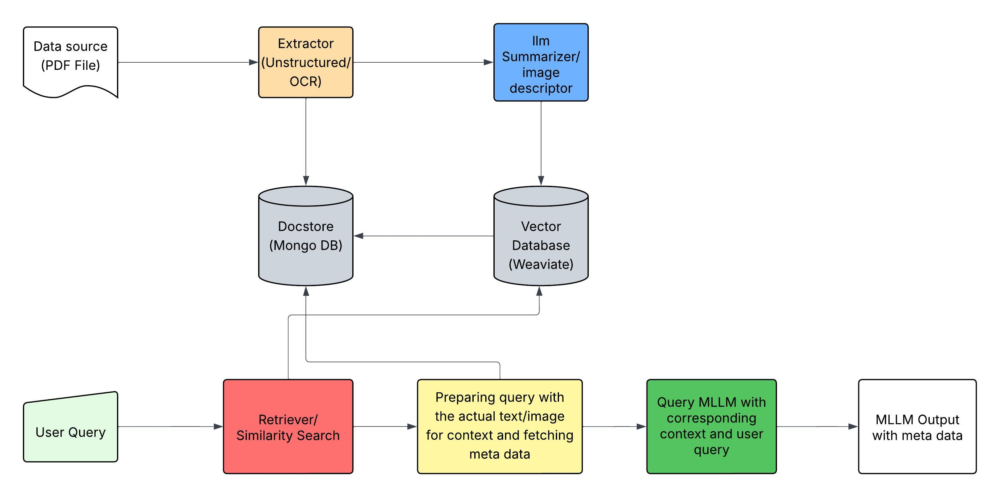

# MRAG - Multimodal RAG PDF Question Answering

## Overview

MRAG (Multimodal Retrieval-Augmented Generation) is a powerful tool that enables users to upload any PDF document (books, user manuals, reports) and ask questions about its content. The system leverages multimodal processing to understand both text and visual elements within the document, providing comprehensive answers based on the entire context.

## Key Features

- **PDF Processing**: Upload any PDF document for analysis
- **Multimodal Understanding**: Processes both text and images within documents
- **Natural Language Querying**: Ask questions in plain English about any aspect of the document
- **Context-Aware Responses**: Receives answers that incorporate information from relevant sections
- **Interactive Web Interface**: User-friendly Streamlit interface for easy document upload and querying

## System Architecture

MRAG uses a "Summarization and Descriptive Embedding" approach where:

1. PDFs are preprocessed to extract text, images, and tables using Unstructured.io
2. A multimodal LLM (Claude 3.7 Sonnet) to generate detailed descriptions for extracted images
3. These texts and descriptions are embedded into a single vector database (weaviate)
4. Image embeddings are mapped to a unique ID linked to the original content
5. Metadata for text and images are stored in a separate database (Mongo DB) to provide context to user
5. During inference, the system:
   - Vectorizes the user query
   - Performs similarity search to retrieve relevant content
   - Fetches the corresponding images/metadata using unique IDs
   - Generates comprehensive answers using the retrieved context



## Technology Stack

- **Backend**: Python with FastAPI
- **Frontend**: Streamlit for interactive web interface
- **MLLM**: Claude 3.7 Sonnet (via AWS Bedrock)
- **Vector Database**: Weaviate
- **Key Libraries**:
  - Unstructured: For extracting elements from PDFs
  - LangChain: For implementing retrieval pipelines with ChromaDB
  - Weaviate: For efficient similarity search
  - MongoDB: For Document and metadata storage

## Installation

To run the application as one docker container create 
a environment file (.env) containing all the environment variables as shown in .env.example file.
```bash
git clone https://github.com/prvnsingh/mrag.git
docker compose up --build

```

To run the application by setting up individual components: backend, frontend and vector DB, follow the below commands

```bash
# Clone the repository
git clone https://github.com/prvnsingh/mrag.git
cd mrag

# Create and activate a virtual environment (optional but recommended)
python -m venv venv
source venv/bin/activate  # On Windows: venv\Scripts\activate

# Install dependencies
pip install -r requirements.txt

# Set up environment variables
cp .env.example .env
# Edit .env with your AWS credentials and other configuration
# AWS_REGION=#####
# AWS_ACCESS_KEY_ID=################
# AWS_SECRET_ACCESS_KEY=#################
# OCR_AGENT=pytesseract
# TESSERACT_LANGUAGE=eng
# UNSTRUCTURED_HI_RES_MODEL_NAME=yolox
# MONGO_URI=######### (MongoDB URI)
# no need of WEAVIATE_HOST as we will spin it locally

# Spin the docker image of Weaviate to setup local vectorDB
docker-compose docker-compose-vector-db.yml up -d


```

## Usage

To run the application:

Run the back end framework
### 1. FastAPI Backend
```bash
# Start the FastAPI server
uvicorn app.main:app --reload

# Access the API
# Open your browser and go to http://localhost:8000/docs
```

Run the frontend
### 2. Streamlit Interface (Recommended)
```bash
# Start the Streamlit app
streamlit run app/streamlit_app.py

# Access the web interface
# Open your browser and go to http://localhost:8501
```


## Project Structure

```
src/
├── app/
│   ├── main.py           # FastAPI application
│   ├── streamlit_app.py  # Streamlit interface
│   ├── config.py         # Configuration settings
│   └── prompt.py         # Prompt templates
├── components/           # Reusable components
├── services/            # Core services
├── resources/           # Static resources
└── settings.py          # Project settings
```

## Future Improvements

1. Implement an ensembled extraction pipeline using tools like Pix2Text for more accurate extraction of images, tables, and mathematical equations
3. Develop a better ranking mechanism using re-ranking models
4. Add support for more document formats beyond PDF
5. Implement user authentication and document management
6. Add batch processing capabilities for multiple documents

## Contributions

Contributions are welcome! Please feel free to submit a Pull Request.

## License

This project is licensed under the MIT License - see the LICENSE file for details.
