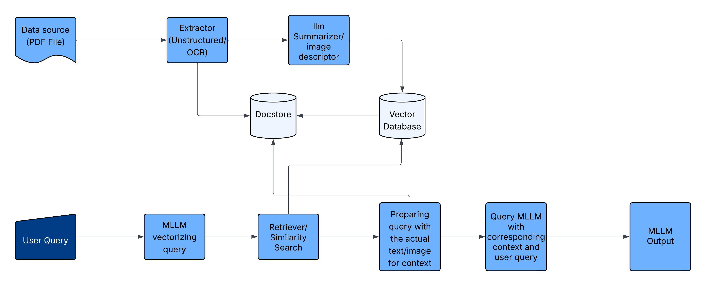

# MRAG - Multimodal RAG PDF Question Answering

## Overview

MRAG (Multimodal Retrieval-Augmented Generation) is a powerful tool that enables users to upload any PDF document (books, user manuals, reports) and ask questions about its content. The system leverages multimodal processing to understand both text and visual elements within the document, providing comprehensive answers based on the entire context.

## Key Features

- **PDF Processing**: Upload any PDF document for analysis
- **Multimodal Understanding**: Processes both text and images within documents
- **Natural Language Querying**: Ask questions in plain English about any aspect of the document
- **Context-Aware Responses**: Receives answers that incorporate information from relevant sections

## System Architecture

MRAG uses a "Summarization and Descriptive Embedding" approach where:

1. PDFs are preprocessed to extract text, images, and tables
2. A multimodal LLM (Claude 3.7 Sonnet) generates:
   - Summaries for extracted text
   - Detailed descriptions for extracted images
3. These summaries and descriptions are embedded into a single vector database
4. Each embedding is mapped to a unique ID linked to the original content
5. During inference, the system:
   - Vectorizes the user query
   - Performs similarity search to retrieve relevant content
   - Fetches the corresponding text/images using unique IDs
   - Generates comprehensive answers using the retrieved context



## Technology Stack

- **Backend**: Python with FastAPI
- **MLLM**: Claude 3.7 Sonnet (via AWS Bedrock)
- **Vector Database**: ChromaDB
- **Key Libraries**:
  - Unstructured: For extracting elements from PDFs
  - LangChain: For implementing retrieval pipelines with ChromaDB

## Installation

```bash
# Clone the repository
git clone https://github.com/yourusername/mrag.git
cd mrag

# Create and activate a virtual environment (optional but recommended)
python -m venv venv
source venv/bin/activate  # On Windows: venv\Scripts\activate

# Install dependencies
pip install -r requirements.txt

# Set up environment variables
cp .env.example .env
# Edit .env with your AWS credentials and other configuration
```

## Usage

```bash
# Start the FastAPI server
uvicorn app.main:app --reload

# Access the web interface
# Open your browser and go to http://localhost:8000
```

## Future Improvements

1. Implement an ensembled extraction pipeline using tools like Pix2Text for more accurate extraction of images, tables, and mathematical equations
2. Introduce a dedicated datastore (MongoDB/PostgreSQL) to persist extracted content and metadata
3. Develop a better ranking mechanism using re-ranking models or hybrid retrieval techniques

## Contributions

Contributions are welcome! Please feel free to submit a Pull Request.

## License

This project is licensed under the MIT License - see the LICENSE file for details.
